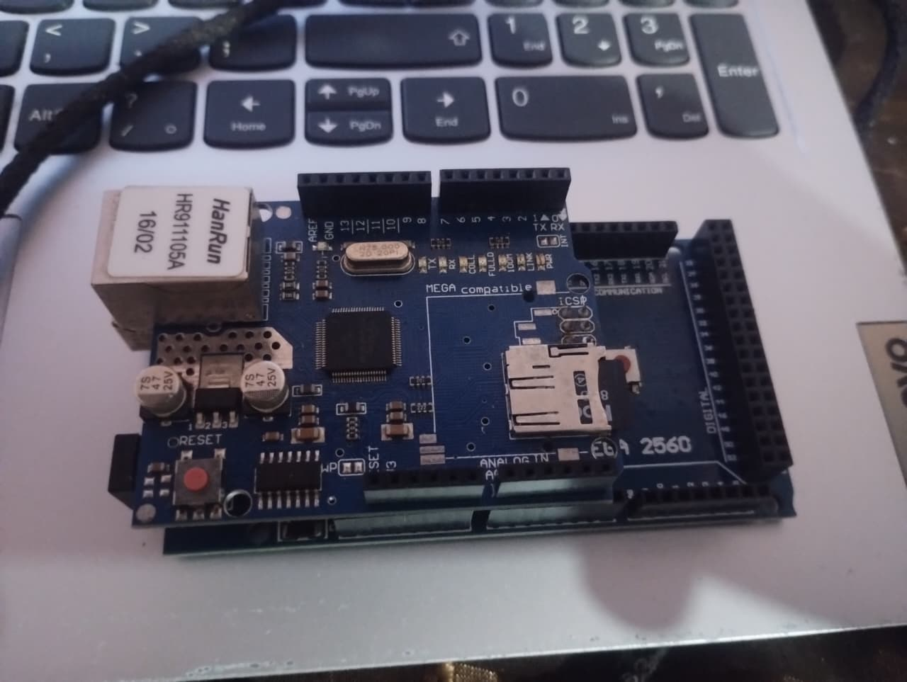
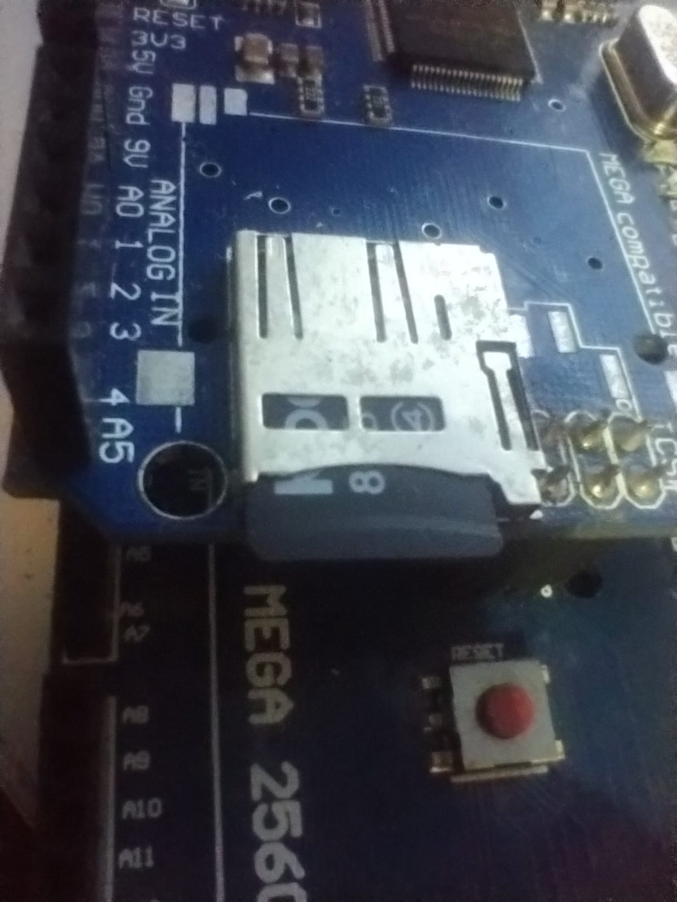

# MakerHub_arduino
Esse projeto foi feito no Arduíno Mega2560 com a placa W5100, para a realização de um servidor Web, com funcionalidade de comunicar com outros projetos arduínos,registrar inventários, logs, configurações e mais.

# O que deve fazer antes
Antes de você copiar esse código, preciso levantar os requisitos para você conseguir tornar-lo funcional, sem desespero e com tranquilidade

### FERRAMENTAS IMPORTANTES
A primeira ferramenta que vc deve instalar:

- Arduino IDE

Será nele que haverá a comunicação com a placa Arduino Mega 2560

**Bibliotecas importantes**

Dentro do Arduino IDE, é importante instalar as bibliotecas que fazem o código funcionar e comunicar com a outra placa (W5100) via Ethernet:

- SPI
- Ethernet
- SD

Se você nao souber onde pode incluir essas bibliotecas, bastas você acessar na aba **Sketch** > **Gerenciar Biblioteca**.

**RECURSOS IMPORTANTES**

Esteja em mãos um cartão SD, que tenha no mínimo 8 GB, será necessário para o armazenamento do servidor.
Será utilizado na placa W5100 como na imagem abaixo:

### PASSO A PASSO

Primeiramente, em seu cartão SD, você irá criar 5 arquivo que irá compor seu servidor:

- index.htm
- invent.csv
- devide.csv
- logs.txt
- config.txt

**`OBS: Você é livre para modificar cada arquivo do jeito que desejar, mas lembre-se que o hardware que estou propondo são bastante limitado`**

Após isso, você irá seguir esses seguintes passo-a-passos

- Copie o código do arquivo **`MakerHub.cpp`** e cole no Arduíno IDE;

- Conecte a placa W5100 em seu wifi com um cabo ETHERNET;

- Abra o **`Monitor Serial`** e veja se aparece o IP DO DISPOSITIVO

- Localize o IP e cole em seu navegador, e verá o resultado em tela

# CONSIDERAÇÕES

Esse projeto foi feito para o Laboratório Maker recém-inaugurada em minha universidade,

No laboratório tem seus materiais diversos, onde possui bastantes Arduínos em disposição para produção de novos projetos, e a maioria das vezes são produzidos com o objetivo educacional.

**Onde surgiu a ideia do Servidor em arduino?**

Como o nosso laboratório é recente, percebi que havia necessidade de um servidor, para facilitar comunicações de projetos, além de criar um inventário.

E o mais importante...

Não havia computadores, celulares ou até um Raspberry Pi para a criação de um servidor.

Então na procura e descobrimento de novas peças existente no armário do laboratório, nasceu essa ideia de um possível servidor em um Arduíno.